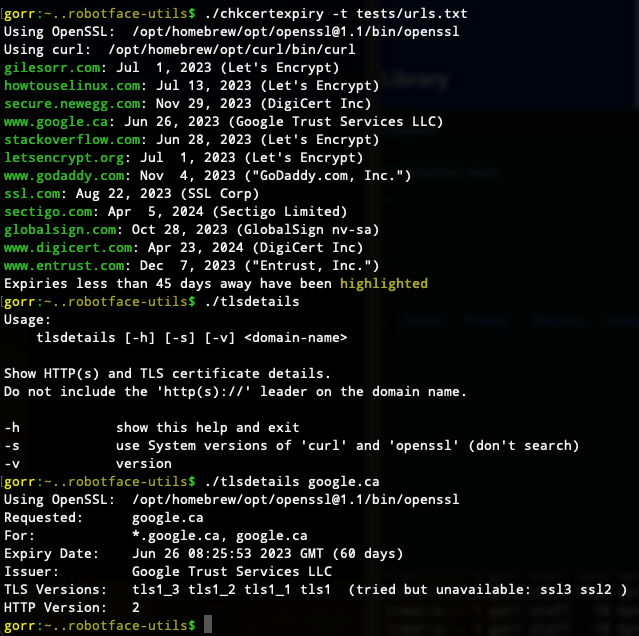

# robotface-utils - <|°_°|>

Website-related utility scripts.

## Introduction

This set of utility scripts (initially two, and a library they both use)
were born out of my work at <a href="https://tpl.ca">Toronto Public
Library</a> (<a href="https://github.com/TorontoPublicLibrary/">TPL Open
Projects at GitHub</a>).  When I told some friends about the
`chkcertexpiry` script, they thought it was worth sharing.  My bosses
graciously agreed to me publicly releasing these scripts, which were
written and are maintained as part of my work at TPL.  I hope they're
useful.

## OS Support

This is developed on both an Apple-Silicon Mac and Linux machines (mostly
Debian, occasionally Fedora).  Some commits I think are innocuous may be
made with incomplete testing, but generally this should run fine on any of
these platforms.

I'm attempting to support both Linux's OpenSSL Project `openssl` and Mac's
LibreSSL `openssl` binaries, and likewise Linux's GNU `sed` and Mac's BSD
`sed`.  They behave identically on rudimentary commands, but when you start
getting into the weeds (and as I add features to this project I'm
definitely getting into the weeds ...) it may become very difficult to
support both.  Detection and separate behaviours for each binary is
possible, but two different `openssl` output layouts being piped into two
different `sed` binaries is already four possible outcomes to deal with ...
we'll see how it goes.

Please use tagged releases: they're generally better tested.

## chkcertexpiry

Live-checks the expiry date of TLS certificates for a set of websites.
Run the script to see a help message.

## tlsdetails

Check a few more details of an individual website, the address of which is
passed on the command line.  Again: run the script to see a help message.

## If You're Using a Mac ...

In 2021 - after TLS v1.3 came into wide use - macOS's versions of `curl`
and `openssl` still didn't support TLS v1.3.  As an attempt to support
people on older Macs, the `robotface_utils` library used by both scripts
attempts to detect other versions of those two programs - notably the
Homebrew versions which are (possibly) better and usually more
up-to-date.  If the detection seems to be causing problems or you're sure
you have a modern version of the OS (I know everything's fine with both
Monterey and Ventura on Intel or Mac silicon), use `-s` to use the system
versions of `curl` and `openssl` without bothering to search for other
versions.

## Explanations

Some notes on how this is done (incomplete at this point):

- [Date Math](DateMath.md)
- [Connection and Certificate Details](DissectingTheConnection.md)

## Naming

My initial thought was to name this repository GO-utils, but for most
people that would suggest a connection to a <a
href="https://en.wikipedia.org/wiki/Go_(programming_language)">well known
programming language</a> - a connection that doesn't exist.  And I thought
'giles-utils' was a bit too vainglorious.  Then I remembered "`<|°_°|>`,"
a bit of text artwork created by Caravan Palace for their <a
href="https://en.wikipedia.org/wiki/Robot_Face">2015 album of the same
name</a>.  I consider the track "Lone Digger" to be one of the best songs
of the last decade (the <a
href="https://www.youtube.com/watch?v=UbQgXeY_zi4">video</a> is awesome too,
but violent), so this is "robotface-utils."  This is meant to a tribute to
Caravan Palace: if they come after me with lawyers, I'll fold like a house
of cards and rename it.

## TODO

There are TODO lists in the lead-in comments in each of the scripts,
specific to them.  This list is more general.

- load `robotface_utils` first, move colours into library, then have
  user setting of colours after that

